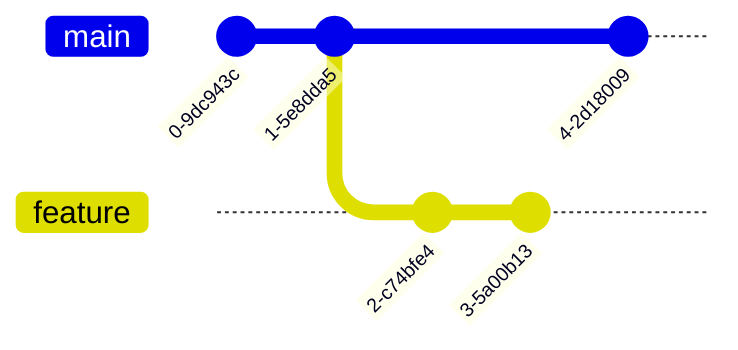
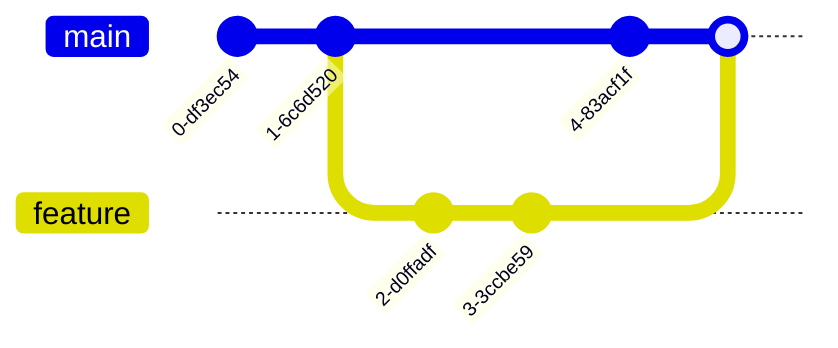

About me
===

- Staff Software Engineer at RubiconMD (now part of CVS / CVS Health)
- Training Engineers since 2005

Built a git course in 2010. Been teaching git since then.

🔗 [](https://www.cursodegit.com)

✉️ cursos@cursodegit.com

🥇 Need to level up your team? or you have specific git challenges? Reach out!

<!-- end_slide -->

<!-- alignment: center -->

Table of contents
===


# Life is too short to waste it...

1. ...typing
2. ...figuring out a git graph
3. ...wait for your AI agents
4. ...reviewing poorly crafted pull requests
5. ...using (only) git 

<!-- end_slide -->

Disclaimer
===

Opinions are my own and do not represent good practices or official guidelines.

This is how I work.

Use it if it works for you. Gracely ignore me if it doesn't.

<!-- end_slide -->

Life is too short to waste it typing
===


<!-- end_slide -->

Git aliases
===

<!-- alignment: center -->

Instead of writing this:

```shell
> git log --oneline --graph --decorate --all
```

write

```shell
> gloga
```

<!-- end_slide -->


Chaining aliases
===

<!-- column_layout: [3,2] -->

<!-- column: 0 -->
<!-- alignment: center -->

You can turn this...

```shell
> git switch main && git pull && git merge chemicalX && git push
```

...into 

```shell
> gswm && gl && gm chemicalX && gp
```

Or this rebase operation...
```shell
> git switch chemicalX && git fetch --prune --all && git rebase origin/main && git push --force-with-lease
```


... into

```shell
> gsw chemicalX && gfa && grb origin/main && gp! 

```
<!-- column: 1 -->


<!-- end_slide -->

If you are lazy as I am...
===

... you don't have to type the aliases yourself!

- fish: 
  - fish abbreviations (using fisher) [](https://github.com/jhillyerd/plugin-git)
- zsh: 
  - ohmyzsh git plugin [](https://github.com/ohmyzsh/ohmyzsh/blob/master/plugins/git/README.md)
- bash:
  - ohmybash git plugin [](https://github.com/ohmybash/oh-my-bash/tree/master/plugins/git)


<!-- end_slide -->

Using git config
===

Using `git config` you can define aliases:

```shell
> git config --global alias.swm "switch main"
```

Then use them like this:

```shell
> git swm
```

Pros:
- use git configuration, valid in any shell

Cons:
- You still need to type git every time... and I'm too lazy for that

```shell
> git sw chemicalX && git fa && git rb origin/main && git swm && git l
```

<!-- end_slide -->

Life is too short to waste it figuring out a git graph
===


<!-- end_slide -->
Do I need to see the whole graph?
===

- Most if the time I just want to see what happened in a single branch. Or maybe two or three branches
- I don't care about all the intermediate commits, I don't want to see the trees in the forest 

<!-- end_slide -->
▶️ `git log` demo!!
===

```bash +exec
vlc --fullscreen --mouse-hide-timeout 0 --no-video-title-show --play-and-exit git-tips-first-parent.mp4
```

<!-- end_slide -->

raw `git log` command
===

- `git log` provides too much information
- No graph structure
- Difficult to read
- Good when we need to look at the tree inside the forest


<!-- end_slide -->

Using `git log` to display the full graph
===

- `git log --oneline --graph` allows us to see the graph structure
- Easier to read
- It still shows too much information: 
  - What did happen in `main`?
  - Do I want to see all those intermediate commits?


<!-- end_slide -->

`--first-parent` to the rescue!!
===

- `git log --oneline --graph --first-parent main` allows us to see what happened in the `main` branch
- Easier to read
- Displays what was merged into `main`
- We can see what was relased in between two releases


<!-- end_slide -->

life is too short to waste it figuring out a git graph
===



<!-- pause -->

To merge `feature` into `main`:

```shell
> gswm
> gm feature
```

<!-- pause -->


This operation creates a `merge commit`



<!-- end_slide -->

Anatomy of a merge commit
===


A `merge commit` has two parents:

- First parent is the commit at which HEAD (`main`) was pointing when the merge happened
- Second parent is the commit at which the branch we pull into HEAD (`dboyd13/feat/amazon-bedrock-secrets`) was pointing when the merge happened

```shell +line_numbers {3}
> gsh
commit 7d6b970cbd3c216353cb22b383b70c150140662e (HEAD -> master, origin/master, origin/HEAD)
Merge: 5357e18 960adf0
Author: Rajeev Karuvath <rajeevravindran@users.noreply.github.com>
Date:   Wed Sep 17 13:31:20 2025 -0700

    Merge pull request #264 from dboyd13/feat/amazon-bedrock-secrets

    feat: Amazon Bedrock API key patterns
```

<!-- end_slide -->

Life is too short to waste it figuring out a git graph
===


<!-- pause -->


<!-- end_slide -->

Life is too short to waste it waiting for your AI agents
===


<!-- end_slide -->

Switching contexts: the two scenarios and how my former self addressed them
===

<!-- pause -->

# Scenario 1: doing stuff that takes a long time to run (CI, builds, AI agents...)

Clone the repo in multiple directories

<!-- pause -->

# Scenario 2: Work in multiple branches 

Switch branches + stashing/unstashing changes

<!-- end_slide -->

My actual self uses worktrees!
===

Worktrees allow you to checkout multiple branches at the same time **in different directories**

How this helps me?
- Switching contexts is instant (no need to stash/unstash changes)
- Can work on something else while waiting for other stuff (CI, AI agents, long builds...)

<!-- end_slide -->

How do I switch contexts (worktrees)?
===

`tmux` to the rescue! 🦸‍♂

- Each project has its own session
- Use a different window for each worktree
- Create custom aliases to create and destroy sessions quickly
- Store my tmux sessions with `tmux-resurrect` plugin

<!-- end_slide -->

▶️ Demo time!!
===

```bash +exec
vlc --fullscreen --mouse-hide-timeout 0 --no-video-title-show --play-and-exit demo-worktrees-tmux.mp4
```

<!-- end_slide -->
⚠️ Caveats ⚠️
===

- Database configuration per worktree
- Environment variables per worktree
- Project setup (initial migrations, seeds, database dump restores...)

<!-- end_slide -->

Life is too short to waste it reviewing poorly crafter pull requests
===

<!-- end_slide -->

Remember why we do code reviews (sometimes we forget)
===

- catch bugs early
- share knowledge
- catch things you missed
- different (sometimes better) ways to do the same thing

<!-- end_slide -->

The one rule I follow when crafting a PR
===

# ☝️ Tell a story with my commits

<!-- pause -->

This is the problem we want to fix...

...these are the steps that I took to fix it...

...**this is why I fixed it this way**

<!-- pause -->

The one other rule is avoid AI slop in commit messages and PR descriptions 

<!-- end_slide -->

(two of) The tools that help me tell my story
===

# Interactive staging (`git add -p`)

Several changes in my staging area, but I want to commit them separately

<!-- pause -->

# The fixup feature of `git` 

Several changes in my staging area, but I want to add them to previous commits

<!-- end_slide -->

Example: Fixup the commits in a repository
===

The branch was ready to push...


<!-- pause -->

... then I realised I missed a field in the model


<!-- pause -->

I want the changes added to the right commits in the history

<!-- end_slide -->
▶️ Fixup demo!
===

```bash +exec
vlc --fullscreen --mouse-hide-timeout 0 --no-video-title-show --play-and-exit fixup-demo.mp4
```

<!-- end_slide -->
Fixup: two step process
===

1. Create the fixup commits
2. Rebase and squash

<!-- end_slide -->

Life is too short even for so many git commands...
===

# Welcome lazygit!

A terminal UI for git commands

https://github.com/jesseduffield/lazygit

```bash +exec
vlc --fullscreen --mouse-hide-timeout 0 --no-video-title-show --play-and-exit lazygit-demo.mp4
```


<!-- end_slide -->

Life is too short to waste it using (only) git
===

# Say hello to other third generation VCS tools! jujutsu darcs/pijul sapling piper

- I've been using jujutsu for a couple of months already
- It has improved my git experience a lot

| Feature | Git | Jujutsu (jj) |
| :--- | :--- | :--- |
| **Primary Workflow** | Explicit snapshots (`add` / `commit`) | Continuous (Working copy is always a commit) |
| **The "Index"** | Staging area is central to the workflow | No staging area (everything is tracked) |
| **Conflicts** | **Blocking:** Must be resolved to continue | **Data:** Stored in the commit; fix them later |
| **Branches** | Named branches are required to track work | Anonymous (use "bookmarks" only for remotes) |
| **Safety Net** | `git reflog` (hard to parse) | `jj undo` (first-class, instant rollback) |
| **Rebasing** | Destructive & iterative | Transformative & automatic |
| **Remote Sync** | Pushes/Pulls branches | Syncs bookmarks to Git remotes |
| **Querying** | CLI flags (`--grep`, `--author`) | Functional language (**Revsets**) |

...who knows, maybe I can present jujutsu in another talk!!!

<!-- end_slide -->

🔗 Links to other third generation VCS tools
===

- Jujutsu VCS: [](https://www.jj-vcs.dev/latest)
- Darcs: [](https://darcs.net/)
- Pijul: [](https://pijul.org/)
- Sapling: [](https://sapling-scm.com/)

<!-- end_slide -->

Q&A
===


<!-- alignment: center -->


